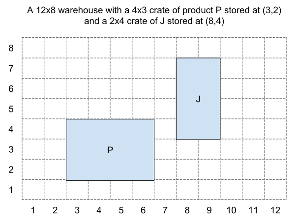

# Simple Warehouse
This is a simple command-line warehouse management tool. The user can record the storage and removal of crates of variable sizes on a grid of dynamic 'shelves'.

It accepts the following 7 commands:

| Command | Description |
| --- | --- |
| `help` | Shows the help message. |
| `init W H` | (Re)Initialises the application with a W x H grid of shelves, with all spaces empty. |
| `store X Y W H P` | Stores a crate of product code P and of size W x H at position (X,Y). The crate will fill W x H slots.|
| `locate P` | Show a list of positions where product code P can be found. |
| `remove X Y` | Remove the crate at positon (X,Y). |
| `view` | Output a representation of the current state of the shelves. Position (1,1) should be at the bottom left position on the grid and (1, H) should be the top left. |
| `exit` | Exits the application. |

- Arguments W, H, X and Y will always be integers, and P will always be a single character.
- You should not worry about validating the format of the input.
- A crate of dimensions 2 x 3 will occupy 6 positions in the grid.

The user should be shown an error message when:
- Trying to store a crate at a position which doesn't exist.
- Trying to store a crate which doesn't fit.
- Trying to remove a crate which doesn't exist.

## Task
Adapt the provided skeleton application with the functionality described above.  Feel free to improve the existing code as you see fit.

We recommend writing unit tests for your code in either RSpec or Minitest to ensure the correct functionality is
achieved.  However, to save time, we suggest you do not write full integration tests that simulate `stdin` and capture `stdout`.

Overwrite this `README`, outlining the reasoning behind your design decisions and any ways in which you think your code could be improved.  If you need to refer back to these instructions, [they are duplicated here](./INSTRUCTIONS.md).

Please either fork this repo and send us a pull request, or return a `tar.gz` of your local repository.

First use the class method instead if instance method because from the begining
I saw this problem from a game prospective. When you have one chart available
for everybody. Some improvement could be to go full singleton design pattern and
use instance method instead.

I improve the speed of execution by caching. The view is now cached. So there is
less computation and more memory use.
It changes instance variable instead of changing copies again less
computation more memory.
It also only compute for new element, so there is the method add_crate instead
of recompute for everything at each call. Less computation.

If we grid a square of size N and we have M crate we went from N^2*M operation before
caching of the grid and after N^2. We could do better by adding a form quick sort
algorythm and to Nlog N.

We could have add more error messages for each cases

### Alternatives to Ruby
If you feel your skills are better demonstrated in a different language, please feel free to submit your solution in the language of your choice.  Be sure to include full instructions on how to build and run your code.
